# Classic Load Balancer Setup and Configuration on AWS
## Introduction
This project demonstrates the deployment and configuration of a Classic Load Balancer (CLB) in AWS. A Classic Load Balancer is designed to automatically distribute incoming traffic across multiple EC2 instances, ensuring improved availability, fault tolerance, and scalability of applications. The Classic Load Balancer operates at both the transport layer (Layer 4) and the application layer (Layer 7), giving it the ability to balance traffic based on both network connections and application requests. It continuously performs health checks to route traffic only to healthy instances, further enhancing fault tolerance.

## Prerequisites
Before setting up the Classic Load Balancer, ensure the following requirements are met:
- AWS Account – with access to EC2 and Load Balancer services
- Running EC2 Instances – at least two instances in the same VPC and region
- Security Groups configured to allow:
    - Inbound HTTP (port 80) and/or HTTPS (port 443) traffic
    - Inbound SSH (port 22) access for administration (optional)
- Web Server Installed (e.g., Apache or Nginx) on each EC2 instance, serving a sample page

## Steps to Setup Classic Load Balancer
### Step 1: Launch 3 EC2 Instances with User Data Script
1. Launch 3 Instance.
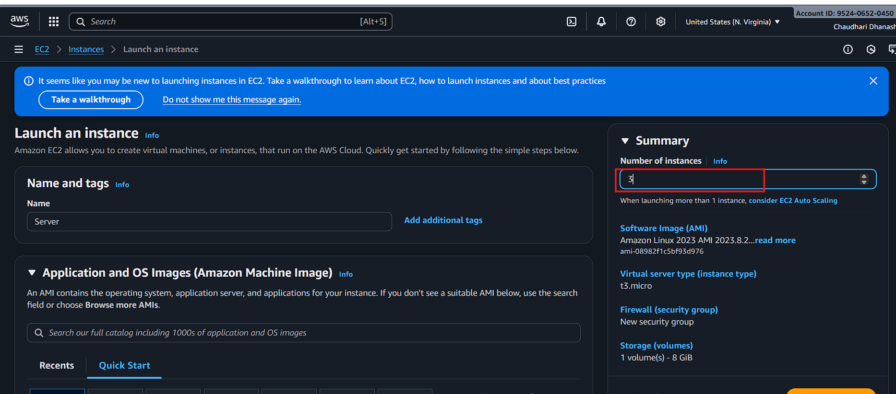

2. Write user script while launching instance.
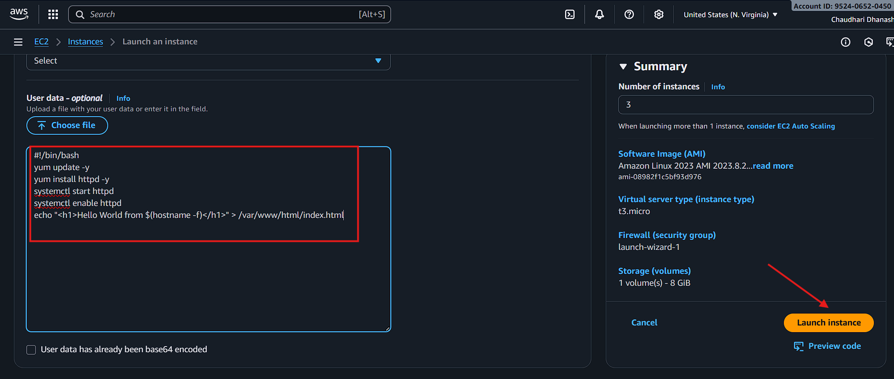

3. Rename the 3 instance with different names(server-1, server-2, server-3)
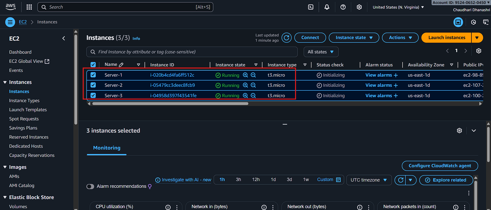

### Step 2: Create a Classic Load Balancer
1. Go to Load Balancer.
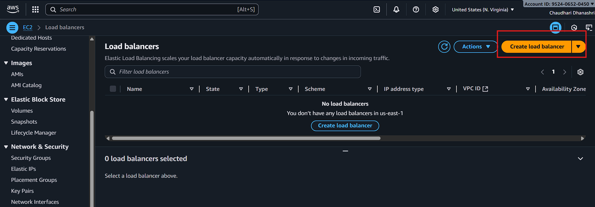

2. Choose Classic Load Balancer.
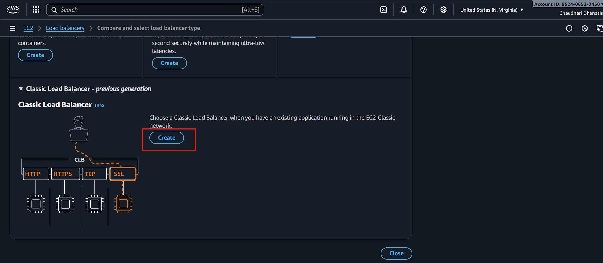

3. Name the Load Balancer 
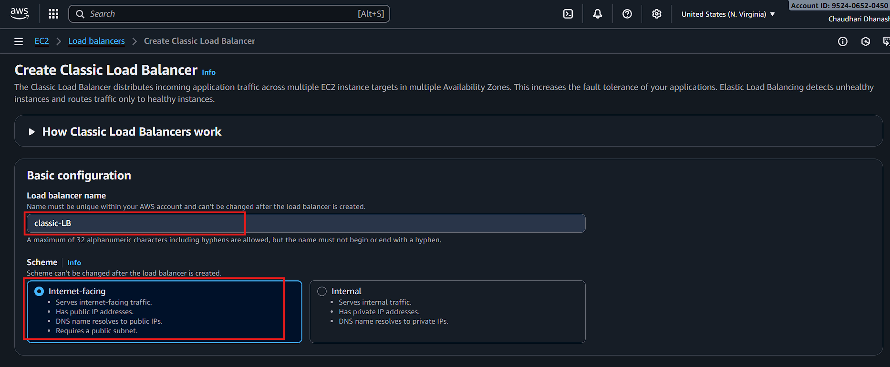

4. Select all Availability Zones.
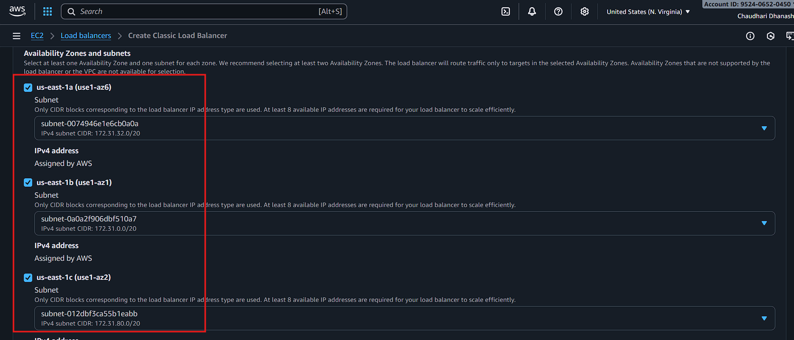

5. Manage Security Group
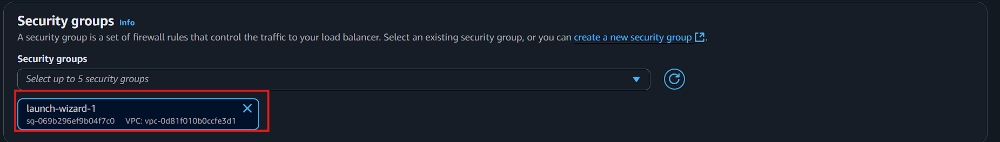

6. Add instances to Load Balancer
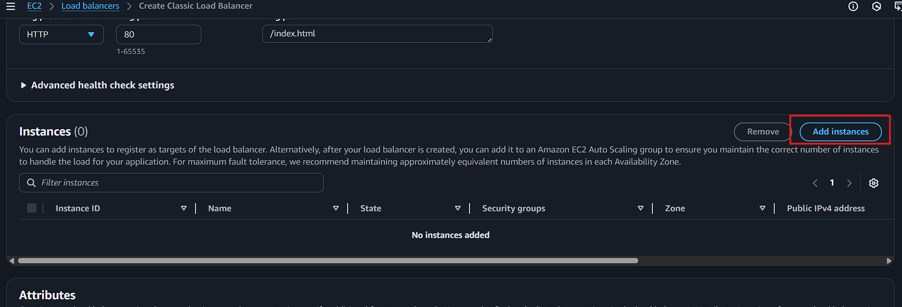

    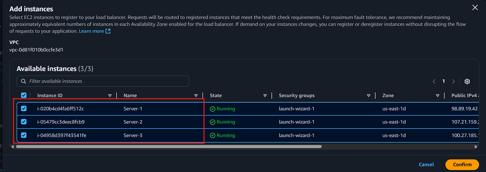

    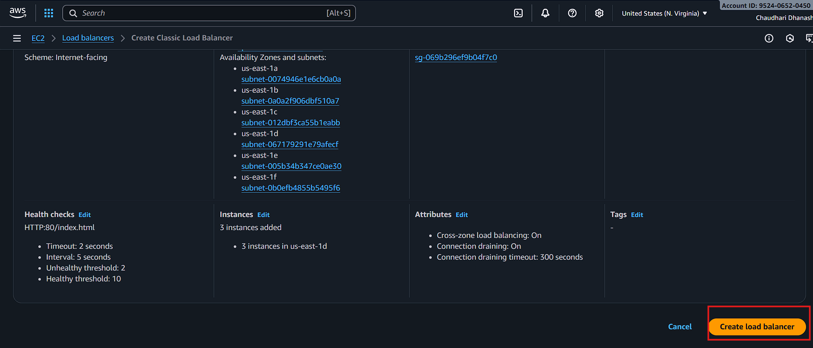

7. Copy DNS command and paste it in any browser.
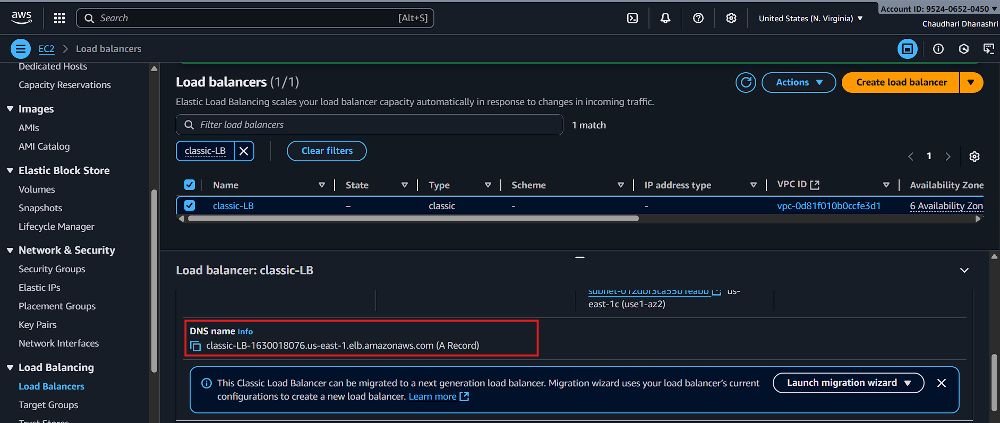

### Step 3: Testing the Deployment.
1. Output for Server-1
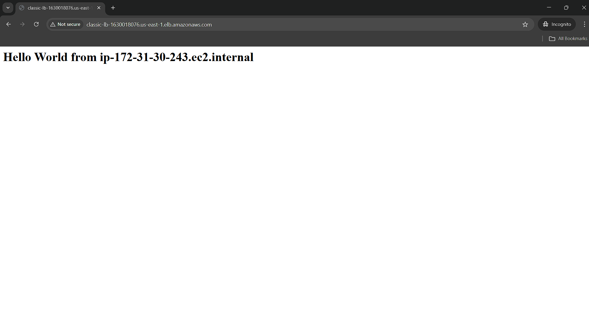

2. Output for Server-2
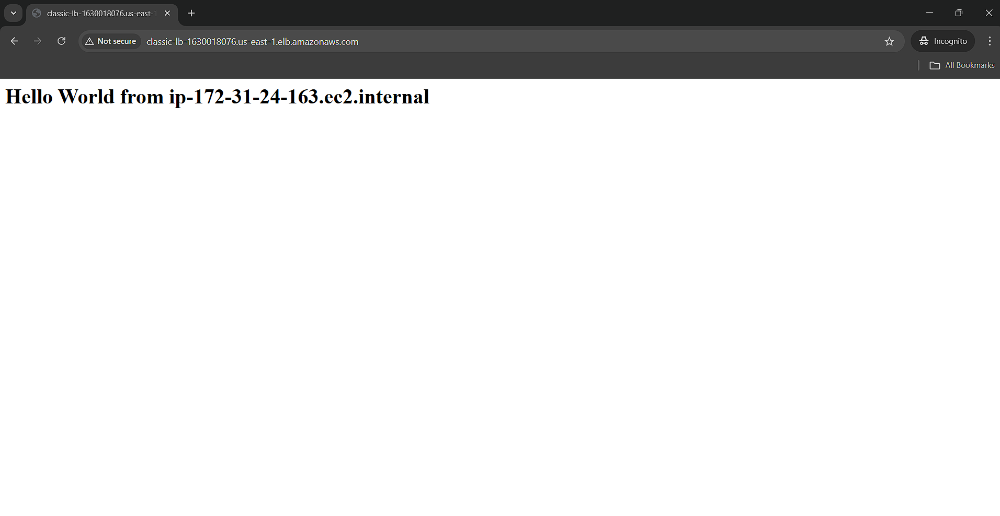

3. Output for Server-3
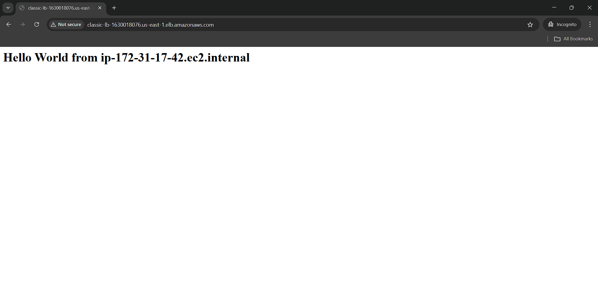

## Summary
This project demonstrates the deployment and configuration of a Classic Load Balancer (CLB) in AWS to distribute incoming traffic across multiple EC2 instances. By launching three instances with a user-data script, the setup ensures that each instance runs a web server and serves unique content, allowing you to verify traffic distribution.